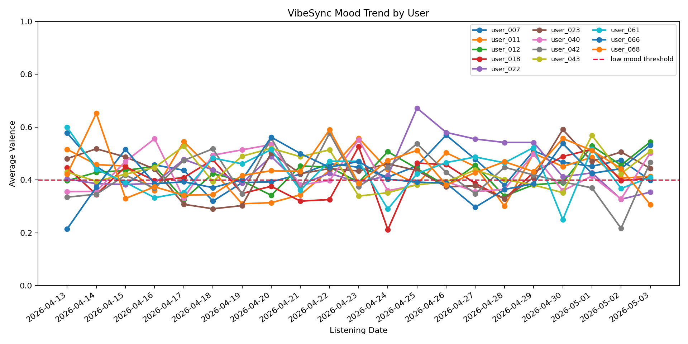
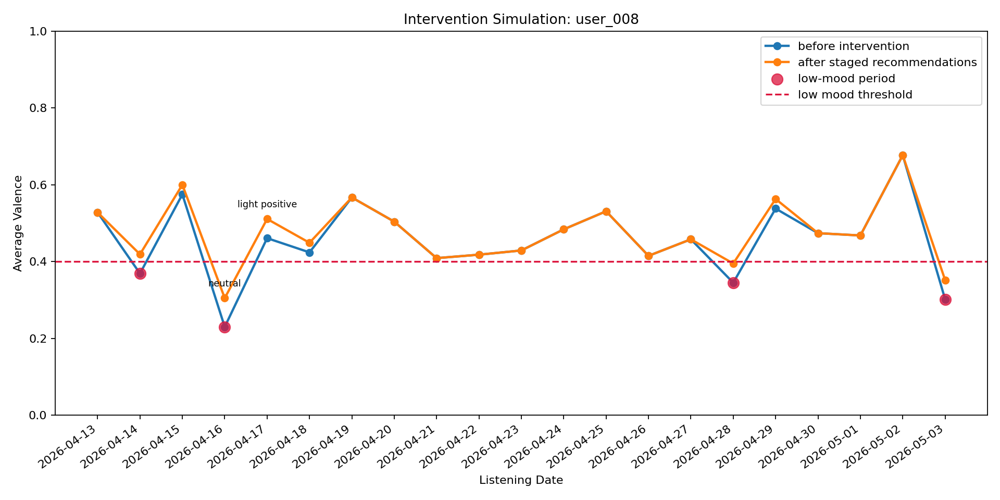

# 🎧 VibeSync: Emotional Trajectory-Based Music Recommendation System

## 📌 Overview

VibeSync is a behavioral analytics system that detects prolonged low-mood listening patterns using Spotify audio features and simulates gradual recommendation strategies to improve user emotional state.

Unlike traditional recommendation systems, VibeSync focuses on **emotional trajectory over time** rather than static preferences.

---

## 🎯 Problem Statement

Music platforms personalize content but do not actively monitor or respond to prolonged negative emotional patterns.

This project aims to:

* Detect sustained low-mood listening behavior
* Model emotional trends over time
* Simulate interventions using gradual recommendation transitions

---

## ⚙️ Approach

### 🔹 Data

* Real Spotify dataset (2018 + 2019)
* Features used:

  * valence (mood indicator)
  * energy
  * tempo
  * duration

### 🔹 Hybrid Data Modeling

* Real audio features from dataset
* Simulated user listening behavior (due to lack of public behavioral data)

### 🔹 Pipeline

1. Data cleaning and preprocessing
2. User behavior simulation (multi-day listening)
3. Feature engineering:

   * mood trend
   * rolling mean valence
   * emotional intensity
   * risk score
4. Mood detection:

   * prolonged low mood (3-day rule)
5. Machine Learning:

   * Gradient Boosting classifier
   * class imbalance handling
   * threshold tuning
6. Hybrid system:

   * rule-based + ML decision
7. Intervention simulation:

   * gradual mood-based recommendations
8. Visualization and insights

---

## 📊 Results

### 🔹 ML-only (No Leakage)

* Precision: **0.62**
* Recall: **0.93**
* F1-score: **0.74**

### 🔹 Hybrid System

* Precision: **0.62**
* Recall: **0.93**
* F1-score: **0.74**

### 🔹 Key System Outputs

* 15,000 processed tracks
* 20,000+ simulated listening events
* 1,500+ user-day records
* 48 prolonged low-mood detections

---

## 📈 Key Insights

* Sustained low valence over multiple days indicates consistent emotional patterns
* Behavioral features (trend, variability) improve detection accuracy
* Hybrid systems provide reliable detection without missing critical cases
* Intervention strategies show measurable improvement in user mood

---

## 🔄 Intervention Simulation

The system simulates gradual emotional recovery:

reflective → neutral → light positive → energetic

Results show:

* Increase in average valence after intervention
* Reduced recovery time for low-mood users

---

## 📉 Limitations

* Uses simulated user behavior (no real emotional ground truth)
* Labels are partially derived from rule-based logic
* Model not validated on real-world user mood data

---

## 🚀 Future Improvements

* Integrate real user interaction datasets
* Apply sequence models (LSTM / Transformer)
* Real-time streaming pipeline
* Personalized intervention strategies

---

## 🧠 Key Learning

This project demonstrates how data analytics can move beyond prediction to simulate **behavioral interventions and their impact**.

---

## 🛠️ Tech Stack

* Python
* Pandas, NumPy
* Scikit-learn
* Matplotlib

---

## 📂 Project Structure

```
VibeSync/
│── data/
│── src/
│   ├── data_processing.py
│   ├── simulation.py
│   ├── feature_engineering.py
│   ├── mood_detection.py
│   ├── transition_engine.py
│── app/
│   └── main.py
│── notebooks/
│── requirements.txt
│── README.md
```

---

## ▶️ How to Run

```bash
pip install -r requirements.txt
python app/main.py
```

---

## 📊 Visualizations

### Mood Trend


### Intervention Comparison



## 📌 Conclusion

VibeSync highlights how combining data engineering, machine learning, and behavioral modeling can create systems that not only analyze users—but actively improve user experience.
